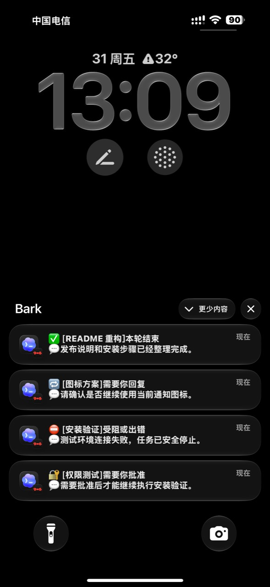
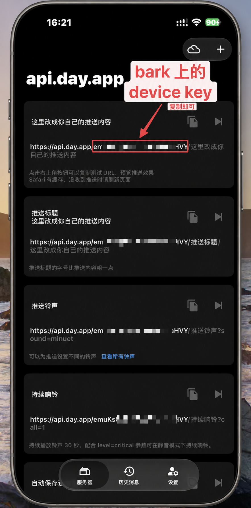
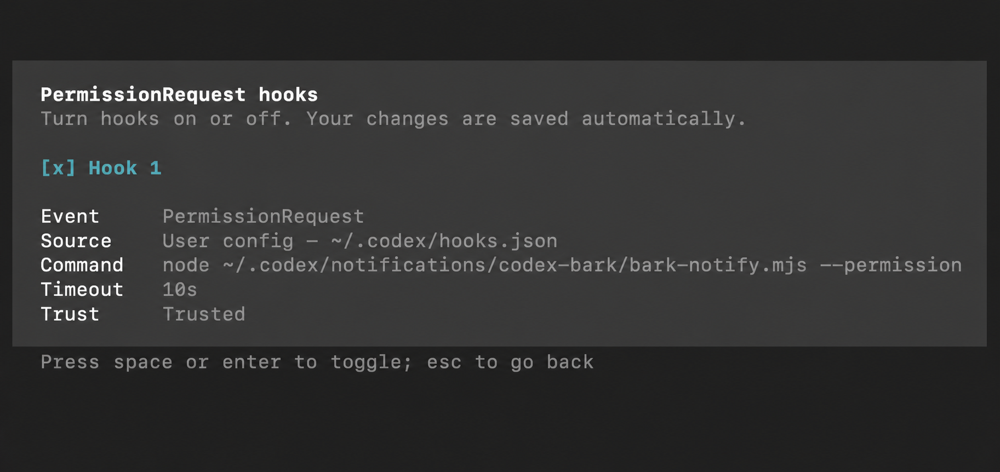

# Codex Bark Notifier

> Mac 上的 Codex 任务完成，手机上并不会有通知。此项目用 bark 解决了 iOS 手机上无通知的问题，并进行了些体验上的优化。

[5 分钟开始](#5-分钟开始) · [交给 Codex 安装](docs/INSTALL_WITH_CODEX.md) · [查看已知限制](#已知限制)



> iPhone 实机演示。任务名称和正文均为虚构示例，不包含 Device Key、真实任务 ID 或私人对话。

## 手机上会看到什么

通知使用四种固定格式。标题说明状态和任务；前三种正文显示本轮回答摘要，批准通知因为尚无最终回答，正文保留本轮请求简称：

```text
✅ [任务名称]本轮结束
💬回答摘要

🔁 [任务名称]需要你回复
💬回答摘要

⛔ [任务名称]受阻或出错
💬回答摘要

🔐 [任务名称]需要你批准
💬本轮请求简称
```

- **任务名称**：优先使用 Codex 侧边栏名称，最多 16 个 Unicode 字符。
- **回答摘要**：从该轮已封口最终回复中提取首个具体结论，清理格式、路径、链接和明显凭据后，最多 46 个 Unicode 字符。
- **本轮请求简称**：批准通知尚无最终回复时使用，最多 30 个 Unicode 字符。
- **图标、分组和声音**：默认使用 Codex 风格图标、`Codex` 分组和 `minuet` 声音。
- **点击通知**：在 iPhone 上打开 ChatGPT 的 Codex Remote；当前不承诺精确定位到对应任务。

## 普通 bark 通知与针对 Codex 优化的后的 bark 通知区别

| 简单通知脚本的常见问题 | 本项目的处理 |
| --- | --- |
| Codex 还在输出，手机已经提示完成 | 精确读取本轮最终回复，再延迟 5～15 秒推送 |
| 子代理每结束一次都通知 | 只通知可确认属于用户主任务的完成事件 |
| 同一轮重复触发 | 使用 `thread-id + turn-id` 持久化去重 |
| 所有情况都显示“完成” | 区分结束、需要回复、受阻出错、需要批准 |
| 多个任务同时运行时无法辨认 | 标题显示任务名称，正文显示回答摘要 |
| 点击通知后仍要手动寻找 Codex | 携带 ChatGPT 任务链接，打开 Codex Remote |
| 密钥写在脚本、URL 或命令行中 | Device Key 只保存在本机私有文件 |
| 通知失败后无法排查 | 保留不记录密钥和对话正文的 JSONL 审计日志 |

完成通知来自 Codex 官方 `agent-turn-complete` 外部通知事件；批准提醒来自官方 `PermissionRequest` Hook。Hook 只负责提醒，不会替你批准、拒绝或绕过 Codex 的信任机制。

## 适用范围

适合以下用户：

- 在 macOS 上使用 Codex Desktop 或 Codex CLI；
- 使用 iPhone 和 [Bark](https://github.com/Finb/Bark)；
- 经常运行需要数分钟甚至更久的 Codex 任务；
- 希望只在任务结束或被识别为需要介入时回到电脑前。

当前版本要求 Node.js 22 或更高版本。其他操作系统尚未承诺支持。

平时可以只在 Codex Desktop 中工作；但要启用“需要你批准”通知，Mac 上还必须能在 Terminal 运行 Codex CLI，以便通过 CLI 的 `/hooks` 页面检查并信任 `PermissionRequest` Hook。先运行 `command -v codex`；如果没有输出，请按 [Codex CLI 官方安装页](https://learn.chatgpt.com/docs/codex/cli)完成安装。如果 CLI 中没有 `/hooks` 命令，请先按同一官方页面更新 CLI，再继续信任步骤。

## 5 分钟开始

> Bark Device Key 相当于推送凭据。它只应在独立 Terminal 的隐藏输入框中粘贴，不要发送到 Codex、其他 AI 对话、GitHub Issue、截图、仓库文件、命令行参数或环境变量。

### 在 Bark 哪里找 Device Key

打开 iPhone 上的 Bark，进入底部的“服务器”页面。页面里的推送示例地址类似：

```text
https://api.day.app/[DEVICE_KEY]/推送内容
```

`api.day.app/` 后、下一个 `/` 前的那一段就是 Device Key。只复制这一段备用，不要把完整真实地址发送给 Codex、其他 AI、GitHub Issue，或放进公开截图。



### 方式 A：交给 Codex 安装（推荐）

1. 在 iPhone 安装 Bark，并在 App 中取得当前设备的 Device Key。
2. 在 Mac 的 Terminal 运行 `command -v codex`；如果没有输出，先按 [官方说明](https://learn.chatgpt.com/docs/codex/cli)安装 Codex CLI。
3. 打开 [通过 Codex 安装 codex-bark-notifier 指南](docs/INSTALL_WITH_CODEX.md)，把其中不含密钥的完整提示词发送给 Mac 上的 Codex。
4. Codex 会检查环境、运行测试和 `--dry-run`，到真正安装时暂停，只给你一条 Terminal 命令。
5. 确认 `--dry-run` 与真实安装命令使用同一个 Codex Home。如果预检发现非默认 `CODEX_HOME`，真实安装命令必须保留同一路径，例如以 `env CODEX_HOME='/实际路径'` 开头；不要在独立 Terminal 中悄悄退回 `~/.codex`。
6. 在独立的 macOS Terminal 运行该命令。看到 `Bark Device Key (input hidden):` 后粘贴 Bark Device Key；输入不显示字符是正常现象。
7. 回到 Codex，只回复“安装器执行完成”，不要粘贴 Key 或包含 Key 的输出。
8. Codex 最多发送一条测试通知并暂停；请根据 iPhone 的实际显示明确回复“已收到”或“未收到”，不要让 Codex 仅凭 Bark API 成功就判定手机已经收到。
9. 在独立 macOS Terminal 运行 `codex` 启动 Codex CLI，再输入 `/hooks`，检查并信任 `PermissionRequest` Hook；如果没有该命令，先更新 CLI。随后重启 Codex Desktop。
10. 新建一个小任务验证“本轮结束”；以后遇到真实批准请求时再验证“需要你批准”。

### 方式 B：手工安装

先确认 Node.js 和 Codex CLI：

```bash
node --version
command -v codex
```

Node.js 版本必须为 22 或更高；`command -v codex` 必须输出可执行文件路径。如果没有输出，先按 [Codex CLI 官方安装页](https://learn.chatgpt.com/docs/codex/cli)完成安装，然后运行：

```bash
git clone https://github.com/jiangsir-tech/codex-bark-notifier.git
cd codex-bark-notifier
npm run test:all
node scripts/install.mjs --dry-run
node scripts/install.mjs
```

安装器会隐藏 Device Key 输入，并备份、合并现有 Codex 配置。它不会提供 `--key <secret>` 参数。

`--dry-run` 与真实安装必须输出同一个 Codex Home。设置了非默认 `CODEX_HOME` 时，应在同一个 Terminal 会话中连续运行两条命令，避免环境变量丢失。

高级的非 AI 自动化场景可使用 `node scripts/install.mjs --key-file /absolute/path/to/private-key-file`。参数接收的是仓库外的私有文件路径，不是 Key 本身；安装器会拒绝符号链接、硬链接和不安全权限。普通用户应优先使用隐藏交互输入。

如果 `--dry-run` 报告现有 `notify` 或 Hooks 已被其他程序修改，请停止，不要强制覆盖。安装器的拒绝是为了保护已有配置。

### 安装后验证

1. 以安装器输出的 Codex Home 和安装目录为准。安装器会自动使用当前 `CODEX_HOME`；未设置时才使用 `~/.codex`。
2. 在 macOS Terminal 运行 `codex`，进入 Codex CLI 后输入 `/hooks`；确认新增命令指向上述安装目录内的通知脚本，再选择信任。如果 CLI 没有 `/hooks` 命令，请先按 [官方安装页](https://learn.chatgpt.com/docs/codex/cli)更新 CLI。
3. 重启 Codex。
4. 只运行一次安装后的测试命令，验证 Mac 到 Bark 的链路。下面的命令会自动使用当前 Terminal 中的 `CODEX_HOME`，未设置时使用 `~/.codex`：

   ```bash
   node "${CODEX_HOME:-$HOME/.codex}/notifications/codex-bark/bark-notify.mjs" --test
   ```

5. 如果安装器输出的实际路径与当前 Terminal 的 `CODEX_HOME` 不同，请使用安装器输出的完整脚本路径。
6. 根据 iPhone 的实际显示确认是否收到测试通知；HTTP 请求成功本身不能证明通知已显示在手机上。



图中 `[x] Hook 1` 表示 Hook 已启用，`Trust  Trusted` 表示当前命令已经受信任。该脱敏示意图根据实际界面整理，已隐藏用户名、本机绝对路径和无关启动日志。

## 基础配置

公开配置示例见 [examples/config.example.json](examples/config.example.json)。默认安装位置是 `~/.codex/notifications/codex-bark/`；设置 `CODEX_HOME` 后使用对应目录。

| 配置项 | 默认值 | 说明 |
| --- | ---: | --- |
| `bark.endpoint` | `https://api.day.app/push` | Bark JSON POST 地址，也可改为自建服务 |
| `group` | `Codex` | Bark 通知分组 |
| `sound` | `minuet` | 通知声音 |
| `icon` | 项目公开图标 URL | 通知左侧自定义图标 |
| `requestTimeoutMilliseconds` | `8000` | HTTP 请求超时 |

敏感的 Device Key 不在 JSON 中，而是保存在权限为 `600` 的 `bark-device-key` 私有文件中。图标使用无需登录即可访问的 HTTPS URL；Bark 会缓存相同 URL，换图时应更换文件名或版本参数。

如果希望回答摘要更稳定，可以在个人 `AGENTS.md` 中要求最终回答首句给出可独立理解的具体结论，并尽量控制在 42 个可见字符以内。通知器仍会自行跳过空泛开场、清理敏感内容，并执行 46 字出口上限；安装器不会自动修改 `AGENTS.md`。

## 工作原理

```text
Codex 主任务本轮结束
        │
        ▼
agent-turn-complete
        │
        ├─ 确认主任务归属
        ├─ 精确读取该 turn-id 的最终回复
        ├─ 分类、清理、去重
        └─ 延迟 5～15 秒
                    │
                    ▼
              Bark → iPhone

Codex 即将请求批准
        │
        ▼
PermissionRequest Hook
        │
        └─ 即时提醒，不自动批准
```

为提取任务名称、父子任务关系和回答摘要，项目会尽力而为地只读解析 Codex 本地会话元数据。找不到精确匹配的 `task_complete` 最终回复时，正文退回本轮请求简称，不会拿下一轮或中间进度替代。无法确认属于主任务的完成事件会被抑制。

官方参考：[Codex notifications](https://learn.chatgpt.com/docs/config-file/config-advanced#notifications)、[Codex hooks](https://learn.chatgpt.com/docs/hooks)、[Bark 自定义推送图标](https://github.com/Finb/Bark/blob/master/docs/en-us/tutorial.md)。

## 隐私与安全

- Device Key 只保存在本机私有文件，不写入源码、Codex 配置、Hook、日志或后台任务。
- 审计日志不记录密钥、用户对话正文、最终回复或完整 HTTP 请求。
- 后台任务只保存线程、轮次、状态和延迟等最小引用数据。
- 通知正文会把清理和截断后的摘要发送到所配置的 Bark 服务；介意公共服务时可使用自建 Bark Server。
- 点击跳转会携带不透明的 Codex 任务 ID，但不包含任务正文或 ChatGPT 登录凭据。
- 不要在公开 Issue 中粘贴密钥、完整配置、私密路径、原始日志或未脱敏截图。

完整安全模型和私密报告方式见 [SECURITY.md](SECURITY.md)。

## 常见问题

- **手机没有通知**：检查 Bark 通知权限、网络、Device Key 和审计日志中的 `failed`。
- **完成有通知，批准没有**：在 Codex CLI 中打开 `/hooks` 检查并信任 Hook，确认脚本路径存在，然后重启 Codex Desktop；如果 CLI 没有 `/hooks` 命令，请先更新 CLI。
- **一轮收到多次完成通知**：检查是否仍安装旧版 `Stop` Hook 或另一套 Bark 通知，并在日志中查找 `suppressed_subagent`、`suppressed_duplicate`。
- **通知到了，Codex 仍在输出**：完成通知默认延迟 5～15 秒；批准通知不会延迟。
- **图标仍是 Bark 图标**：检查公开 HTTPS 图片 URL；更新图标时更换 URL 以避开缓存。
- **失败却显示本轮结束**：状态来自文本规则，不是 Codex 权威状态；提交问题时只提供脱敏后的最小示例。

## 更新与卸载

更新前查看 [CHANGELOG.md](CHANGELOG.md)，然后运行：

```bash
git pull --ff-only
npm run test:all
node scripts/install.mjs --dry-run
node scripts/install.mjs
```

如果预览报告受管 `notify` 或 Hooks 已变化，请停止并人工核对，不要强制覆盖。

默认卸载保留 Device Key、日志和备份：

```bash
node scripts/uninstall.mjs --dry-run
node scripts/uninstall.mjs
```

确认不再需要任何私有数据时才使用 `node scripts/uninstall.mjs --purge`。`--purge` 删除一旦开始便不可逆；它只处理固定的受管路径，不会猜测性修改无法安全恢复的 Codex 配置。

## 已知限制

- 当前只面向并测试 macOS 与 Node.js 22+。
- Codex、通知进程或系统在事件产生前硬崩溃时，可能来不及通知。
- “需要回复”和“受阻或出错”依赖文本规则，存在误判和漏判可能。
- Codex 内部会话结构不是稳定公共 API，增强解析可能随 Codex 更新失效。
- 为避免误报，无法确认属于主任务的完成事件会被抑制，可能造成少量漏报。
- 当前已测试版本中，点击任务链接可进入 Codex Remote，但不保证精确定位到对应任务；该行为可能随 ChatGPT 或 iOS 更新变化。
- 项目不会监控每个内部步骤，也不提供远程控制或自动批准。

## 开发与发布

运行 `npm run test:all` 可执行语法检查和完整测试。发布前还应在独立临时环境验证安装、重复安装、更新、卸载、既有 `notify`/Hooks 合并以及真实 Bark 推送。

维护者检查清单见 [docs/RELEASING.md](docs/RELEASING.md)。

## 许可证与声明

本项目原创代码和项目文档使用 [MIT License](LICENSE)。第三方名称、图标、商标和素材不包含在该授权中，详见 [NOTICE.md](NOTICE.md)。

Codex Bark Notifier 是独立社区项目，不是 OpenAI 官方产品，也与 OpenAI、Codex 或 Bark 无隶属、赞助或官方合作关系。
